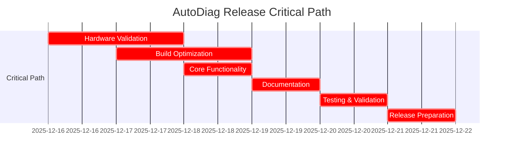

# AutoDiag Release Critical Path Analysis

## 🎯 Critical Path Overview

This document identifies and analyzes the critical path items that must be completed for a successful AutoDiag release within 5 days. These are the essential components that directly impact the release timeline and success.

## 🔴 Critical Path Items

### 1. Hardware Validation and Integration

**Impact:** High - Without working hardware integration, the diagnostic functionality cannot operate.

**Dependencies:**
- GoDiag GD101 J2534 device
- OBDLink MX+ adapter
- CAN bus database
- Protocol implementations

**Tasks:**
- [ ] Validate GoDiag GD101 J2534 integration (4 hours)
- [ ] Test OBDLink MX+ functionality (3 hours)
- [ ] Verify dual-device workflow (2 hours)
- [ ] Validate CAN bus database queries (2 hours)
- [ ] Test error handling and recovery (2 hours)

**Risk Level:** High - Hardware issues can significantly delay release
**Mitigation:**
- Have fallback protocols ready
- Implement comprehensive error logging
- Document workarounds for known issues

**Contingency Plan:**
- If hardware validation fails, focus on simulator/mock mode
- Document hardware requirements clearly
- Provide alternative testing methods

### 2. Build System Optimization

**Impact:** Critical - Without a working build system, no release is possible.

**Dependencies:**
- PyInstaller configuration
- All Python dependencies
- Asset files (icons, documentation)
- Windows installer creation

**Tasks:**
- [ ] Optimize PyInstaller spec file (2 hours)
- [ ] Test build process reliability (3 hours)
- [ ] Validate dependency inclusion (2 hours)
- [ ] Test installer creation (2 hours)
- [ ] Verify executable on clean systems (2 hours)

**Risk Level:** Critical - Build failures block release
**Mitigation:**
- Maintain multiple build configurations
- Implement automated build validation
- Document manual build procedures

**Contingency Plan:**
- Provide source code distribution if build fails
- Document manual installation procedures
- Create virtual environment setup guide

### 3. Core Diagnostic Functionality

**Impact:** Critical - Core functionality must work for the release to be valuable.

**Dependencies:**
- Hardware integration
- Protocol implementations
- Database connectivity
- UI components

**Tasks:**
- [ ] Test DTC reading/clearing (3 hours)
- [ ] Validate live data streaming (3 hours)
- [ ] Test vehicle identification (2 hours)
- [ ] Verify protocol switching (2 hours)
- [ ] Test error recovery (2 hours)

**Risk Level:** Critical - Core functionality issues make release unusable
**Mitigation:**
- Implement comprehensive error handling
- Provide clear error messages
- Document known limitations

**Contingency Plan:**
- Focus on most common vehicle protocols
- Implement graceful degradation
- Provide manual override options

### 4. Documentation Completion

**Impact:** High - Users need documentation to use the software effectively.

**Dependencies:**
- Finalized functionality
- Screenshots and examples
- Hardware specifications
- Troubleshooting information

**Tasks:**
- [ ] Write Quick Start Guide (4 hours)
- [ ] Create User Manual (6 hours)
- [ ] Document hardware setup (3 hours)
- [ ] Write troubleshooting guide (3 hours)
- [ ] Prepare release notes (2 hours)

**Risk Level:** High - Poor documentation leads to user frustration
**Mitigation:**
- Prioritize essential documentation
- Use templates and examples
- Include screenshots and diagrams

**Contingency Plan:**
- Provide basic documentation first
- Plan for post-release documentation updates
- Create community documentation portal

### 5. Testing and Validation

**Impact:** Critical - Untested software leads to failures and poor user experience.

**Dependencies:**
- Completed functionality
- Test environments
- Test data and scenarios
- Validation tools

**Tasks:**
- [ ] End-to-end workflow testing (4 hours)
- [ ] Performance testing (3 hours)
- [ ] Error handling validation (3 hours)
- [ ] Edge case testing (3 hours)
- [ ] Regression testing (2 hours)

**Risk Level:** Critical - Inadequate testing leads to release failures
**Mitigation:**
- Prioritize critical test cases
- Implement automated testing where possible
- Document test results thoroughly

**Contingency Plan:**
- Focus on most common use cases
- Implement beta testing program
- Provide clear bug reporting channels

## 📊 Critical Path Timeline

## ⏱️ Time Allocation Analysis

| Critical Path Item | Estimated Time | Buffer Time | Total |
|-------------------|---------------|-------------|-------|
| Hardware Validation | 13 hours | 2 hours | 15 hours |
| Build Optimization | 11 hours | 2 hours | 13 hours |
| Core Functionality | 12 hours | 2 hours | 14 hours |
| Documentation | 18 hours | 2 hours | 20 hours |
| Testing & Validation | 15 hours | 2 hours | 17 hours |
| **Total** | **69 hours** | **10 hours** | **79 hours** |

**Available Time:** 5 days × 10 hours/day = 50 hours
**Time Deficit:** 29 hours

## 🔧 Resource Allocation Strategy

### Time Management

1. **Parallelize Non-Critical Tasks**
   - Documentation can be written while testing is ongoing
   - Build optimization can happen during hardware validation
   - Release notes can be prepared during final testing

2. **Prioritize Critical Components**
   - Focus on hardware validation first
   - Ensure build system works early
   - Validate core functionality before documentation

3. **Time Boxing**
   - Set strict time limits for each task
   - Move to next task when time box expires
   - Revisit incomplete tasks if time permits

### Team Allocation (If Available)

| Role | Responsibilities | Time Allocation |
|------|------------------|-----------------|
| Developer 1 | Hardware validation, core functionality | 100% |
| Developer 2 | Build optimization, testing | 100% |
| Technical Writer | Documentation, release notes | 100% |
| QA Engineer | Testing, validation, bug reporting | 100% |

## 📈 Risk Assessment Matrix

| Risk | Likelihood | Impact | Mitigation Strategy |
|------|------------|--------|---------------------|
| Hardware failure | Medium | High | Use simulators, document requirements |
| Build system issues | High | Critical | Maintain backup build methods |
| Core functionality bugs | High | Critical | Prioritize testing, implement error handling |
| Documentation delays | Medium | High | Use templates, prioritize essential docs |
| Testing gaps | High | High | Focus on critical paths, implement beta testing |
| Time overruns | Very High | Critical | Strict time boxing, parallelize tasks |

## 🎯 Critical Success Factors

### Must Achieve for Release

1. **Working Hardware Integration**
   - GoDiag GD101 operational
   - OBDLink MX+ functional
   - Dual-device workflow validated

2. **Reliable Build System**
   - PyInstaller configuration working
   - All dependencies included
   - Installer creation validated

3. **Core Diagnostic Functionality**
   - DTC reading/clearing working
   - Live data streaming operational
   - Error handling implemented

4. **Essential Documentation**
   - Quick Start Guide complete
   - Hardware setup documented
   - Basic troubleshooting available

5. **Validated Testing**
   - Core workflows tested
   - Critical error cases handled
   - Performance acceptable

### Nice to Have (Post-Release)

- Advanced protocol support
- Comprehensive test coverage
- Complete documentation suite
- Performance optimization
- Additional hardware integrations

## 🛠️ Contingency Plans

### Hardware Issues
- **Plan A:** Fix hardware integration issues
- **Plan B:** Implement simulator/mock mode
- **Plan C:** Document hardware requirements clearly
- **Plan D:** Provide alternative testing methods

### Build System Failures
- **Plan A:** Fix PyInstaller configuration
- **Plan B:** Use alternative build methods
- **Plan C:** Provide source distribution
- **Plan D:** Document manual installation

### Core Functionality Problems
- **Plan A:** Fix critical bugs immediately
- **Plan B:** Implement workarounds
- **Plan C:** Document known limitations
- **Plan D:** Provide manual override options

### Documentation Delays
- **Plan A:** Complete essential documentation first
- **Plan B:** Use templates and examples
- **Plan C:** Plan for post-release updates
- **Plan D:** Create community documentation

### Testing Gaps
- **Plan A:** Focus on critical test cases
- **Plan B:** Implement automated testing
- **Plan C:** Document test results
- **Plan D:** Implement beta testing program

## 📝 Decision Matrix

| Scenario | Decision | Action |
|----------|----------|--------|
| Hardware validation fails | Implement simulator mode | Document limitations, provide workarounds |
| Build system unreliable | Use source distribution | Document manual installation, provide virtual environment setup |
| Core functionality unstable | Focus on most common protocols | Implement graceful degradation, provide manual overrides |
| Documentation incomplete | Prioritize essential guides | Use templates, plan post-release updates |
| Testing incomplete | Focus on critical paths | Implement beta testing, provide bug reporting channels |

## 🎯 Conclusion

The critical path analysis identifies hardware validation, build system optimization, core functionality, documentation, and testing as the essential components that must be completed for a successful AutoDiag release. By focusing on these critical path items and implementing the mitigation strategies and contingency plans, we can significantly increase the likelihood of a successful release within the 5-day timeline.

**Key Recommendations:**
1. Start with hardware validation immediately
2. Ensure build system is working early
3. Validate core functionality before documentation
4. Implement strict time boxing
5. Parallelize non-critical tasks
6. Maintain clear communication
7. Document all decisions and issues

**Success depends on:**
- Focus on critical path items
- Effective time management
- Clear prioritization
- Comprehensive risk mitigation
- Contingency planning

Let's make AutoDiag a reality in 5 days by staying focused on the critical path!