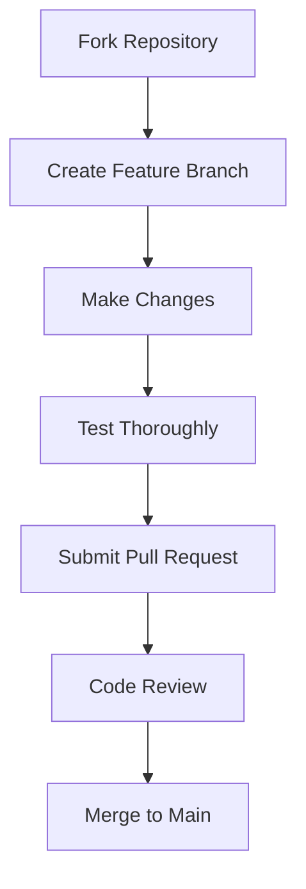

# **COMMUNITY_DISCUSSION.md**


# 🗣️ DiagAutoClinicOS Community Discussion

# 🤝 Welcome to Our Community!

We're building the future of automotive diagnostics together. This document outlines how we collaborate, communicate, and create as a community.

# 📢 Discussion Channels

## Primary Platforms
| Platform | Purpose | Access |
|----------|---------|--------|
| **GitHub Discussions** | Feature requests, Q&A, technical discussions | Public |
| **Discord Server** | Real-time chat, quick help, community bonding | Invite-only |
| **GitHub Issues** | Bug reports, security issues, code problems | Public |
| **Monthly Meetups** | Virtual community meetings, workshops | Public |

## Channel Guidelines
- **Be Specific**: Provide details about your vehicle, setup, and issue
- **Search First**: Check if your question was already answered
- **Use Templates**: Use provided issue and discussion templates

# 🏗️ How to Contribute

## Contribution Workflow


## Development Branches

· main - Stable production code
· develop - Integration branch
· feature/* - New features
· hotfix/* - Critical bug fixes
· release/* - Release preparation

# 💡 Ideas & Feature Requests

## Feature Request Template

```markdown
## Feature Description
**What problem does this solve?**

**Proposed solution**

**Alternative solutions considered**

**Vehicle brands affected**

## Technical Details
**Protocols involved:** [CAN, KWP2000, UDS, etc.]

**Security implications:**

**Estimated development time:**
```

# Voting System

· 👍 Upvote features you want
· 👎 Downvote features you disagree with
· 💬 Comment with use cases and details

# 🐛 Bug Reports

## Bug Report Template

## Bug Description
**What happened?**

**What should have happened?**

## Reproduction Steps
1. Vehicle: [Year, Make, Model]
2. Device: [ELM327, Godiag, etc.]
3. Steps to reproduce:
   - Step 1
   - Step 2
   - Step 3

## Technical Details
- DiagAutoClinicOS Version: [e.g., 3.1.0]
- Python Version: [e.g., 3.10]
- Operating System: [e.g., Ubuntu 22.04]
- Logs: [Attach relevant logs]

## Screenshots/Video
[If applicable]


# 🛠️ Development Discussions

## Code Review Guidelines

· Security First: All code must pass security review
· Tests Required: New features need unit tests
· Documentation: Update docs for all changes
· Style Guide: Follow PEP 8 and project conventions

## Technical Decision Records (TDRs)

``` markdown
We document major technical decisions:

# TDR-001: Protocol Handler Architecture

## Status
[Proposed | Accepted | Replaced]

## Context
[Problem description]

## Decision
[Chosen solution]

## Consequences
[Trade-offs and implications]
```

# 🌟 Community Recognition

## Contributor Levels

Level Requirements Benefits
Beginner First PR merged Welcome package
Contributor 5+ PRs merged Community badge
Maintainer Consistent quality contributions Repository access
Core Team Project leadership Decision-making rights

## Hall of Fame

· Security Champions: Outstanding security contributions
· Protocol Experts: Deep automotive protocol knowledge
· Documentation Heroes: Excellent documentation improvements
· Bug Hunters: Critical bug discoveries

# 📚 Learning Resources

## Getting Started

· Setup Guide
· First Contribution Guide
· Vehicle Compatibility List

## Advanced Topics

· Protocol Deep Dives
· Security Architecture
· Device Integration

## Video Content

· YouTube Channel
· Tutorial Playlist
· Monthly Community Updates

# 🎯 Community Goals

## Short Term (3-6 months)

· Support 30+ vehicle brands
· Achieve 95% test coverage
· Grow community to 500+ members
· Complete security audit

## Long Term (1-2 years)

· Become industry-standard diagnostic tool
· Support all major protocols and standards
· Build manufacturer partnerships
· Achieve automotive security certification

# 📅 Community Events

## Regular Activities

· Weekly Office Hours: Every Thursday 6 PM UTC
· Monthly Workshops: Last Saturday of each month
· Quarterly Hackathons: 48-hour coding events
· Annual Conference: AutoDiag Summit

## Upcoming Events

Date Event Focus
Next Month Protocol Workshop UDS Deep Dive
Q3 Security Hackathon Vulnerability Research
Q4 AutoDiag Summit 2024 Community & Roadmap

# 🏆 Community Guidelines

# Our Values

1. Safety First: Never compromise vehicle or personal safety
2. Open Collaboration: Share knowledge and help others
3. Professionalism: Maintain high standards in all interactions
4. Continuous Learning: Always be improving skills and knowledge
5. Respect: Value diverse perspectives and experiences

# Code of Conduct

· ✅ Be respectful and inclusive
· ✅ Use welcoming language
· ✅ Provide constructive feedback
· ✅ Respect privacy and confidentiality
· ✅ Credit others' work
· ❌ No harassment or discrimination
· ❌ No sharing of proprietary information
· ❌ No unsafe modifications or practices
· ❌ No spamming or self-promotion

# Enforcement

## Violations of community guidelines may result in:

1. Warning and education
2. Temporary suspension
3. Permanent ban for severe/repeated violations

# 🤔 Frequently Asked Questions

## General

Q: Can I use DiagAutoClinicOS for commercial purposes?
A:Yes, with proper licensing. Contact us for commercial use.

Q: Is there a mobile version?
A:Not currently, but it's on our roadmap.

## Technical

Q: Why Python instead of C++?
A: Python provides rapid development, great libraries, and is accessible to more contributors.

Q: How do I add support for my specific vehicle?
A:Check our brand database and protocol documentation. Submit a PR with your additions.

## Legal

Q: Is this legal to use?
A:Yes, for diagnostic and repair purposes. Always comply with local laws and manufacturer agreements.

# 📞 Get Involved

## Immediate Opportunities

· Testing: Help test new features on different vehicles
· Documentation: Improve our guides and tutorials
· Translation: Help translate to other languages
· Community Moderation: Help maintain positive environment

## Long-term Roles

· Protocol Specialists: Deep knowledge of specific protocols
· Security Researchers: Help harden our security
· UI/UX Designers: Improve user experience
· Technical Writers: Create educational content

## Contact Points

· General Questions: GitHub Discussions
· Technical Support: Discord #support channel
· Security Issues: dacos@diagautoclinic.co.za
· Partnerships: dacos@diagautoclinic.co.za

---

# 🚀 Let's Build Together!

We believe that collaborative development creates the best tools. Whether you're a professional mechanic, hobbyist, or developer, there's a place for you in our community.

Join us in revolutionizing automotive diagnostics!

"Alone we can do so little; together we can do so much." - Helen Keller

These comprehensive documents provide:

## **Security.md Features:**
- Clear vulnerability reporting process
- Security architecture overview
- Prohibited actions and restrictions
- Emergency procedures
- Compliance standards

## **Community Discussion.md Features:**
- Multiple engagement channels
- Structured contribution workflow
- Recognition system
- Event calendar
- Code of conduct and values
